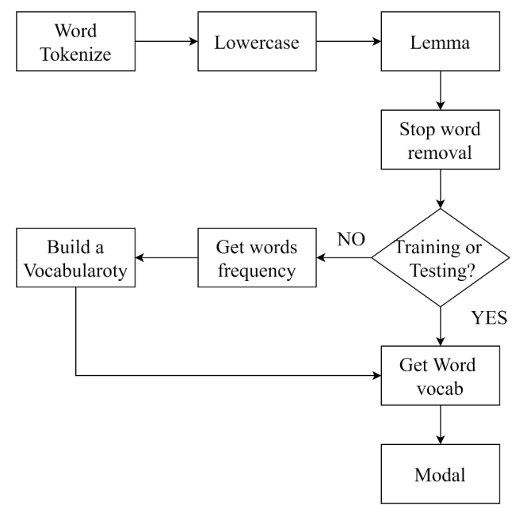

# News-Titles-Classification-by-RNN-and-Transformer
You are given a csv file (train.csv) that contains the corresponding label for BBC news with title and content.
In this project, we implement recurrent neural network (RNN, LSTM or GRU) to correctly classify the news in testing data.

## Requirements
Setup packages
```sh
pip install -r requirements.txt
```

## Text Preprocessing in this projects
- Choose the tokenizer
    - It depends on which languages. [This]((https://blog.ekbana.com/private-nltk-vs-spacy-3926b3674ee4)) and [this](https://www.analyticsvidhya.com/blog/2019/07/how-get-started-nlp-6-unique-ways-perform-tokenization/) document is  provided for your reference.

- Workflow


## RNN
We choose a collection of 50 Billion words and represent each word as a 300-dimensional vector glove as initial embedding.
The pretrained embedding code make words which having the similar meaning closer to each other, and make loger distance between the words having opposite meaning (such as wake and sleep).

```sh
from torchtext.vocab import Vocab
vocab = Vocab(counter, min_freq=2, vectors='glove.6B.300d')
```

